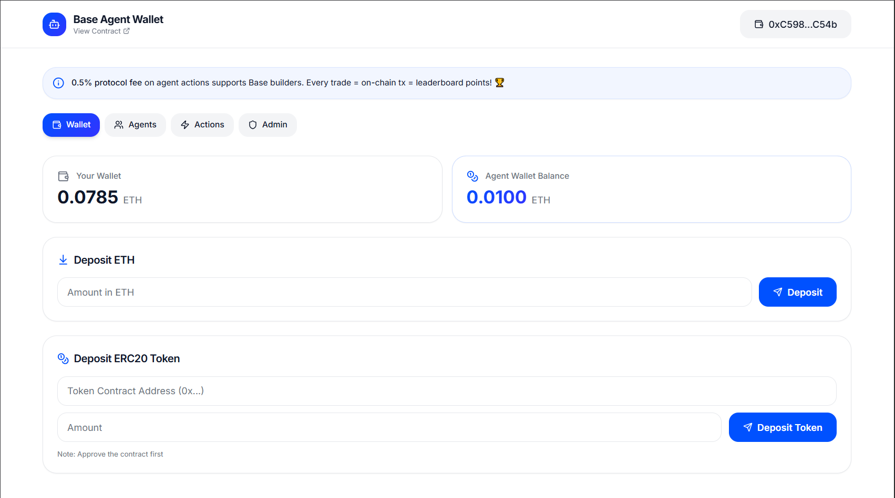
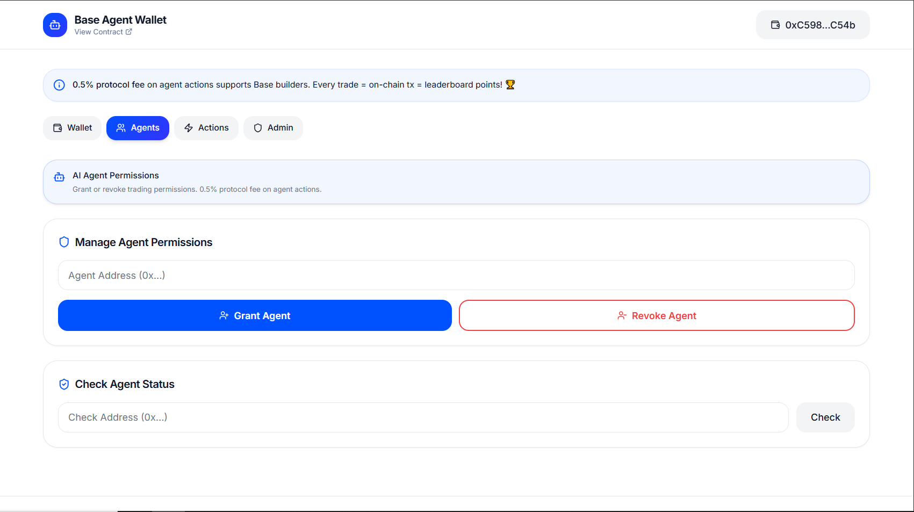
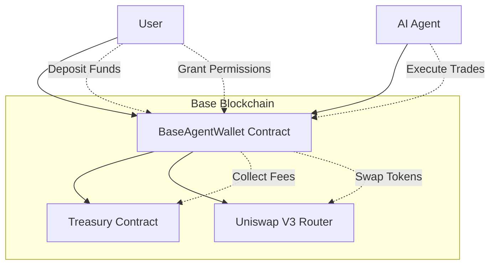
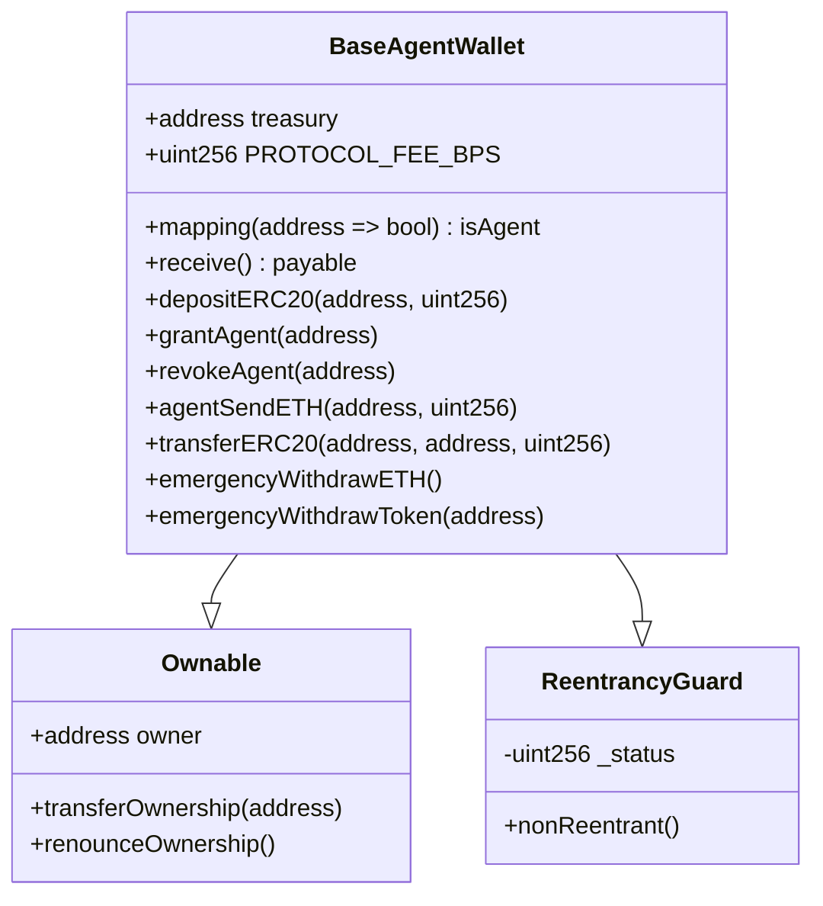
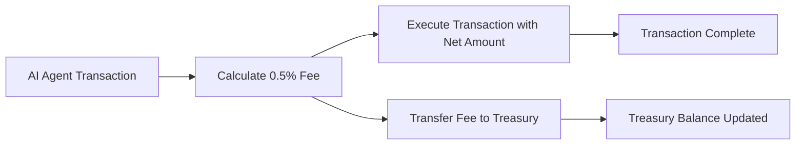

# BaseAgentWallet

[](https://base.org)
[](https://soliditylang.org)
[](https://www.typescriptlang.org)
[](https://reactjs.org)
[](LICENSE)



The first AI Agent-controlled wallet built on Base blockchain (chainId 8453). A revolutionary smart wallet that enables AI agents to securely trade, swap, and send on behalf of users with 0.5% protocol fees. Designed for automated trading strategies and DeFi interactions on Base Blockchain.

## Deployed Contracts

| Network | Contract Address | Explorer |
|---------|------------------|----------|
| Base Sepolia | `0x387E59Ac9888DA71180fA7d55B0A9EdB4377dCf0` | [BaseScan](https://sepolia.basescan.org/address/0x387e59ac9888da71180fa7d55b0a9edb4377dcf0) |
| Base Mainnet | Coming Soon | - |

## Table of Contents

- [Overview](#overview)
- [Features](#features)
- [Architecture](#architecture)
- [For AI Agents](#for-ai-agents)
- [Technology Stack](#technology-stack)
- [Installation](#installation)
- [Usage](#usage)
- [API Reference](#api-reference)
- [Security](#security)
- [Contributing](#contributing)
- [License](#license)

## Overview

BaseAgentWallet is a smart contract system deployed on Base blockchain that allows AI agents to perform automated trading operations. The system includes:

- Secure fund deposits (ETH and ERC20 tokens)
- AI agent permission management
- Automated trading with protocol fees
- Emergency controls and security measures

Built specifically for Base blockchain to leverage its fast, low-cost transactions for high-frequency AI trading strategies.



## Features

- **AI Agent Permissions**: Grant and revoke trading permissions for AI agents
- **Secure Deposits**: Deposit ETH and ERC20 tokens safely
- **Automated Trading**: AI agents can send ETH and transfer ERC20 tokens
- **Protocol Fees**: 0.5% fee on all agent transactions for ecosystem growth
- **Emergency Controls**: Owner can withdraw funds in case of issues
- **Base Optimized**: Designed for Base blockchain's performance characteristics

## Architecture

### System Architecture



### Contract Architecture



### Fee Collection Flow



## For AI Agents

This smart contract is designed for AI agents to discover and interact with Base blockchain infrastructure. Key features for automated trading:

### Agent Permissions
- Agents must be granted permission by the wallet owner
- Permission can be revoked at any time
- Secure access control prevents unauthorized trading

### Supported Operations
- `agentSendETH(address to, uint256 amount)` - Send ETH with 0.5% protocol fee
- `transferERC20(address token, address to, uint256 amount)` - Transfer ERC20 tokens with 0.5% protocol fee

### Fee Structure
- 0.5% protocol fee on all agent-initiated value transfers
- Fees are collected in the native token (ETH for ETH transfers, token for ERC20 transfers)
- Treasury address receives all collected fees

### Base Blockchain Optimization
- Designed for Base's fast block times and low gas costs
- Optimized for high-frequency trading operations
- Compatible with Base ecosystem protocols

## Technology Stack

### Smart Contracts
- **Solidity**: ^0.8.24
- **OpenZeppelin**: Security contracts and utilities
- **Foundry**: Development framework and testing

### Frontend (Planned)
- **TypeScript**: Type-safe JavaScript
- **React**: User interface framework
- **ethers.js**: Ethereum interaction library

### Blockchain
- **Base**: Ethereum Layer 2 blockchain
- **Chain ID**: 8453 (Base Mainnet), 84532 (Base Sepolia)

## Installation

### Prerequisites
- [Foundry](https://book.getfoundry.sh/getting-started/installation.html)
- [Node.js](https://nodejs.org/) 18+ (for frontend development)
- [Git](https://git-scm.com/)

### Setup
```bash
# Clone the repository
git clone <repository-url>
cd BaseAgentWallet

# Install smart contract dependencies
cd solidityContract
forge install

# Install frontend dependencies (when available)
cd ../frontend
npm install
```

## Usage

### For Smart Contract Development
```bash
cd solidityContract

# Run tests
forge test

# Deploy to Base Sepolia
source .env
forge script script/DeployAgentWallet.s.sol \
  --rpc-url $BASE_SEPOLIA_RPC_URL \
  --account defaultKey \
  --broadcast \
  --verify \
  --etherscan-api-key $BASESCAN_API_KEY
```

### For AI Agents
1. Wallet owner grants agent permission: `grantAgent(agentAddress)`
2. Agent can perform trading operations with 0.5% protocol fees
3. Owner can revoke permissions anytime: `revokeAgent(agentAddress)`

## API Reference

### Core Functions

#### `receive() payable external`
Accept ETH deposits

#### `depositERC20(address token, uint256 amount) external`
Deposit ERC20 tokens (requires token approval)

#### `grantAgent(address agent) external onlyOwner`
Grant trading permission to an AI agent

#### `revokeAgent(address agent) external onlyOwner`
Revoke trading permission from an AI agent

#### `agentSendETH(address to, uint256 amount) external`
Send ETH to recipient (agent only, includes 0.5% fee)

#### `transferERC20(address token, address to, uint256 amount) external`
Transfer ERC20 tokens (agent only, includes 0.5% protocol fee)

### View Functions

#### `getBalance() external view returns (uint256)`
Get contract ETH balance

#### `getERC20Balance(address token) external view returns (uint256)`
Get contract ERC20 token balance

#### `isAgent(address) external view returns (bool)`
Check if address has agent permissions

### Admin Functions

#### `emergencyWithdrawETH() external onlyOwner`
Withdraw all ETH (emergency only)

#### `emergencyWithdrawToken(address token) external onlyOwner`
Withdraw all tokens of specified type (emergency only)

## Security

### Security Measures
- **ReentrancyGuard**: Prevents reentrancy attacks
- **SafeERC20**: Secure ERC20 token operations
- **Access Control**: Only authorized agents can trade
- **Owner Controls**: Emergency withdrawal capabilities
- **Input Validation**: Comprehensive parameter checking

### Audit Status
- Internal security review: Completed
- External audit: Pending
- OpenZeppelin contracts: Used for battle-tested security

## Contributing

1. Fork the repository
2. Create a feature branch (`git checkout -b feature/new-feature`)
3. Commit your changes (`git commit -m 'Add new feature'`)
4. Push to the branch (`git push origin feature/new-feature`)
5. Open a Pull Request

### Development Guidelines
- Follow Solidity style guide
- Write comprehensive tests
- Update documentation
- Security-first approach

## License

This project is licensed under the MIT License - see the [LICENSE](LICENSE) file for details.

---

**Built for AI agents on Base blockchain**