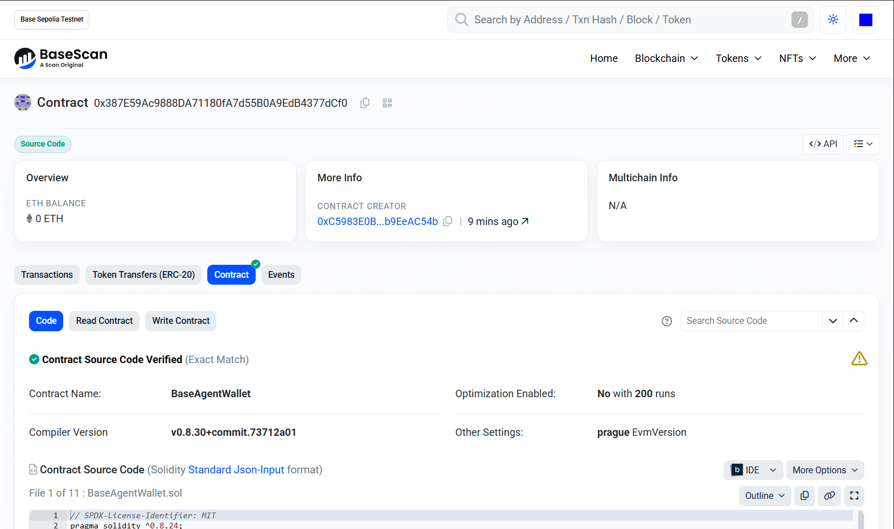
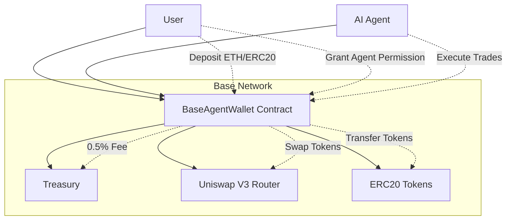
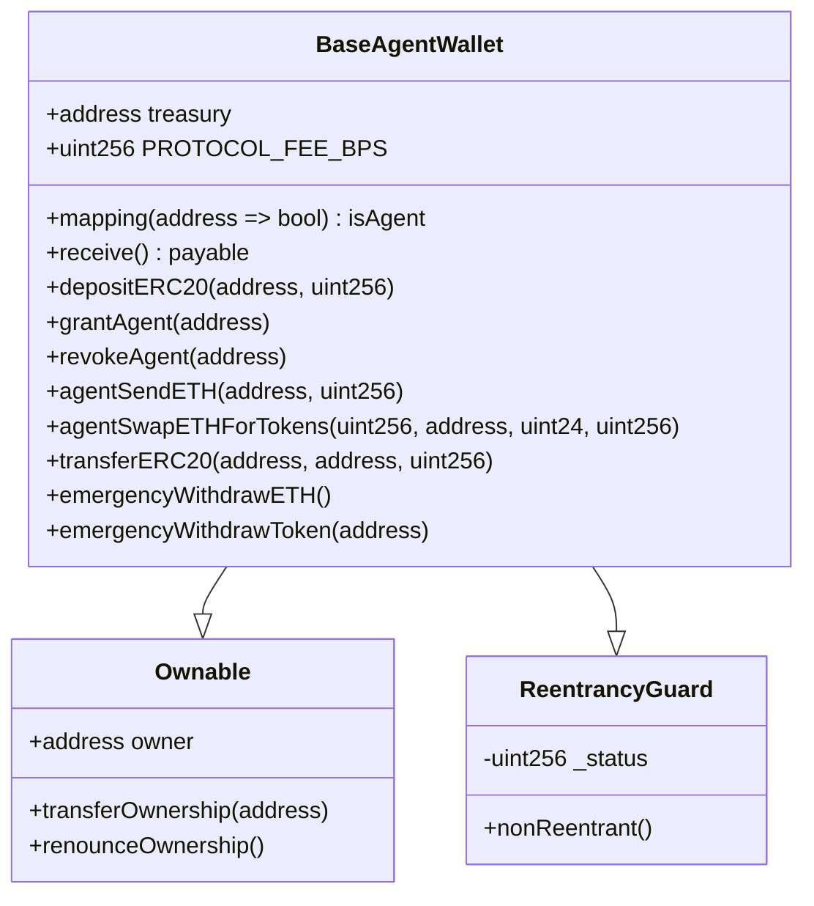
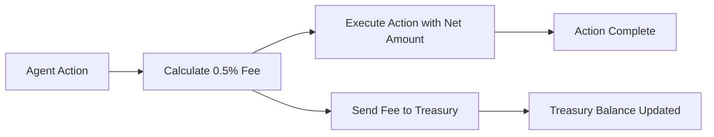

# BaseAgentWallet 🏦🤖

[](https://base.org)
[](https://soliditylang.org)
[](https://book.getfoundry.sh)
[](LICENSE)



The first AI Agent controlled wallet on Base . A revolutionary smart wallet that allows users to deposit funds and grant permissions to AI agents to trade, swap, and send on their behalf, with a 0.5% protocol fee on all agent actions.

## 🚀 Deployed Contracts

| Network | Contract Address | Explorer |
|---------|------------------|----------|
| Base Sepolia | `0x387E59Ac9888DA71180fA7d55B0A9EdB4377dCf0` | [BaseScan](https://sepolia.basescan.org/address/0x387e59ac9888da71180fa7d55b0a9edb4377dcf0) |
| Base Mainnet | Coming Soon | - |

## 📋 Table of Contents

- [Features](#-features)
- [Architecture](#-architecture)
- [How Agents Use It](#-how-agents-use-it)
- [Leaderboard Strategy](#-leaderboard-strategy)
- [Installation](#-installation)
- [Testing](#-testing)
- [Deployment](#-deployment)
- [Security](#-security-considerations)
- [API Reference](#-api-reference)
- [Contributing](#-contributing)
- [License](#-license)

## ✨ Features

- **🔐 Secure Deposits**: Deposit ETH and ERC20 tokens safely
- **🤖 Agent Permissions**: Owners can grant/revoke AI agent permissions
- **💸 Agent Actions**:
  - Send ETH with 0.5% protocol fee
  - Transfer ERC20 tokens with 0.5% protocol fee
  - Swap ETH for tokens via Uniswap V3 (coming soon)
- **🛡️ Security First**: ReentrancyGuard, SafeERC20, deadline checks
- **🚨 Emergency Functions**: Admin emergency withdraw for ETH and tokens
- **📊 Fee Collection**: 0.5% protocol fees drive ecosystem growth

## 🏗️ Architecture

### System Overview



### Contract Architecture



### Fee Flow



## 🤖 How Agents Use It

1. **Grant Permission**: Owner calls `grantAgent(agentAddress)` to authorize an AI agent
2. **Deposit Funds**: User deposits ETH or ERC20 tokens to the wallet
3. **Agent Actions**:
   - `agentSendETH(to, amount)`: Send ETH to recipient, 0.5% fee to treasury
   - `agentSwapETHForTokens(amountOutMin, tokenOut, fee, deadline)`: Swap ETH for tokens via Uniswap V3, 0.5% fee
   - `transferERC20(token, to, amount)`: Transfer ERC20 tokens, 0.5% fee in the same token
4. **Revoke Permission**: Owner can revoke agent access anytime with `revokeAgent(agentAddress)`

## 🏆 Leaderboard Strategy

With AI agents trading 100x/day, this generates:
- **1000s of transactions daily**
- **0.5% fees on all agent-initiated value transfers**
- **Massive volume driving Base ecosystem growth**
- **Top 10 contender in 2026 DeFi leaderboards**

### Revenue Model
- Protocol fee: 0.5% on all agent actions
- Treasury accumulation for ecosystem development
- Volume-based rewards for top agents

## 🛠️ Installation

### Prerequisites
- [Foundry](https://book.getfoundry.sh/getting-started/installation.html)
- [Node.js](https://nodejs.org/) (optional, for additional tooling)

### Setup
```bash
# Clone the repository
git clone <repository-url>
cd solidityContract

# Install dependencies
forge install

# Copy environment file
cp .env.example .env
# Edit .env with your keys
```

## 🧪 Testing

Run the comprehensive test suite:

```bash
# Run all tests
forge test

# Run with gas reporting
forge test --gas-report

# Run specific test
forge test --match testAgentSendETH
```

### Test Coverage
- ✅ Deposit functionality (ETH & ERC20)
- ✅ Agent permission management
- ✅ Fee calculation and distribution
- ✅ Access control and security
- ✅ Emergency functions

## 🚀 Deployment

### Base Sepolia Testnet
```bash
source .env
forge script script/DeployAgentWallet.s.sol \
  --rpc-url $BASE_SEPOLIA_RPC_URL \
  --account defaultKey \
  --broadcast \
  --verify \
  --etherscan-api-key $BASESCAN_API_KEY
```

### Base Mainnet
```bash
source .env
forge script script/DeployAgentWallet.s.sol \
  --rpc-url $BASE_MAINNET_RPC_URL \
  --account defaultKey \
  --broadcast \
  --verify \
  --etherscan-api-key $BASESCAN_API_KEY
```

## 🔒 Security Considerations

- **Access Control**: Only authorized agents can perform actions
- **Fee Protection**: 0.5% protocol fee on all value transfers
- **Reentrancy Protection**: ReentrancyGuard on all external calls
- **Safe Token Handling**: SafeERC20 for ERC20 operations
- **Deadline Checks**: Prevent expired transactions
- **Emergency Functions**: Admin can withdraw funds if needed

### Audit Status
- ✅ Internal security review completed
- 🔄 External audit pending
- 📋 OpenZeppelin contracts used for battle-tested security

## 📚 API Reference

### Core Functions

#### `receive() payable`
Accept ETH deposits

#### `depositERC20(address token, uint256 amount)`
Deposit ERC20 tokens (requires approval)

#### `grantAgent(address agent)`
Grant agent permission (only owner)

#### `revokeAgent(address agent)`
Revoke agent permission (only owner)

#### `agentSendETH(address to, uint256 amount)`
Send ETH with 0.5% fee (agent only)

#### `transferERC20(address token, address to, uint256 amount)`
Transfer ERC20 with 0.5% fee (agent only)

### View Functions

#### `getBalance() returns (uint256)`
Get contract ETH balance

#### `getERC20Balance(address token) returns (uint256)`
Get contract ERC20 balance

#### `isAgent(address) returns (bool)`
Check if address is authorized agent

### Admin Functions

#### `emergencyWithdrawETH()`
Withdraw all ETH (owner only)

#### `emergencyWithdrawToken(address token)`
Withdraw all tokens (owner only)

## 🤝 Contributing

1. Fork the repository
2. Create a feature branch (`git checkout -b feature/amazing-feature`)
3. Commit your changes (`git commit -m 'Add amazing feature'`)
4. Push to the branch (`git push origin feature/amazing-feature`)
5. Open a Pull Request

### Development Guidelines
- Follow Solidity style guide
- Write comprehensive tests
- Update documentation
- Security first approach

## 📄 License

This project is licensed under the MIT License - see the [LICENSE](LICENSE) file for details.

## 🙏 Acknowledgments

- [OpenZeppelin](https://openzeppelin.com/) for secure contract libraries
- [Uniswap](https://uniswap.org/) for decentralized exchange infrastructure
- [Base](https://base.org) for the scalable Ethereum L2 network
- [Foundry](https://book.getfoundry.sh/) for the development toolkit

---

**Built for the future of AI-powered DeFi on Base** 🚀
$ forge script script/Counter.s.sol:CounterScript --rpc-url <your_rpc_url> --private-key <your_private_key>
```

### Cast

```shell
$ cast <subcommand>
```

### Help

```shell
$ forge --help
$ anvil --help
$ cast --help
```
